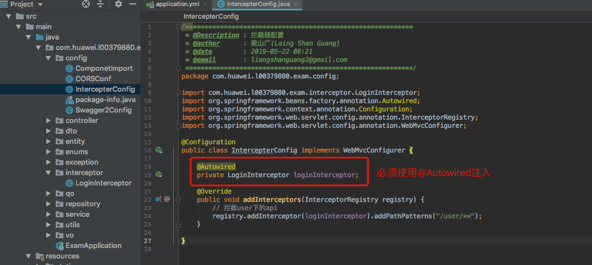

# 在线考试系统的后端实现

## 拦截器注入application.yml中的属性

> 拦截器执行在自动bean初始化之前会导致拦截器中无法注入配置属性，按照下面的步骤即可正常注入

+ 给拦截器加`@Component`注解

  

+ 在配置类中用`@Autowired`注入

  

## 代码调试的时候如何打印完整的SQL语句和参数

> 主要是指application.yml的配置

参考博客[JPA打印SQL参数](https://mp.weixin.qq.com/s/zyTOdTwFhi2CwxCI9P1kQw)


+ 打印SQL语句
  ```yaml
  spring:
    jpa:
      # 调试的时候用，用于打印完成SQL语句(但是不打印参数),联合下面的logging.level一同打印最完整的SQL信息(语句+参数)
      show-sql: true
  ```
+ 不打印SQL语句
  ```yaml
  spring:
    jpa:
      # 调试的时候用，用于打印完成SQL语句(但是不打印参数),联合下面的logging.level一同打印最完整的SQL信息(语句+参数)
      show-sql: false
  ```
+ 打印SQL参数
  ```yaml
  # SQL语句打印(能打印参数，设置为trace是打印完整语句，默认我们就关掉吧)
  logging:
    level:
      org.hibernate.type.descriptor.sql.BasicBinder: trace
  ``` 
+ 不打印SQL参数
  ```yaml
  # SQL语句打印(能打印参数，设置为trace是打印完整语句，默认我们就关掉吧)
  logging:
    level:
      org.hibernate.type.descriptor.sql.BasicBinder: off
  ``` 