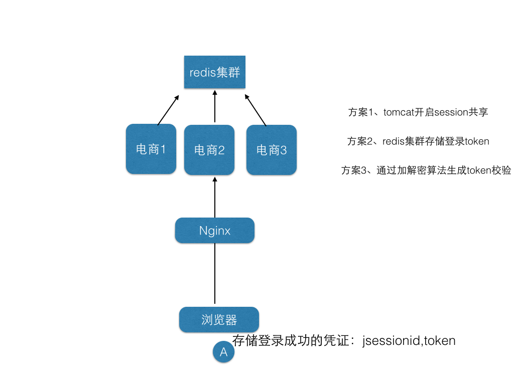
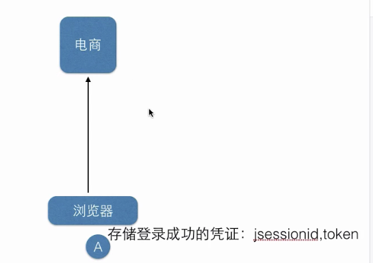
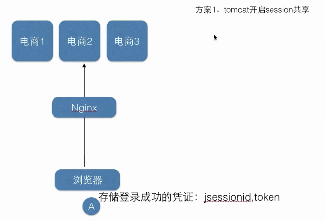
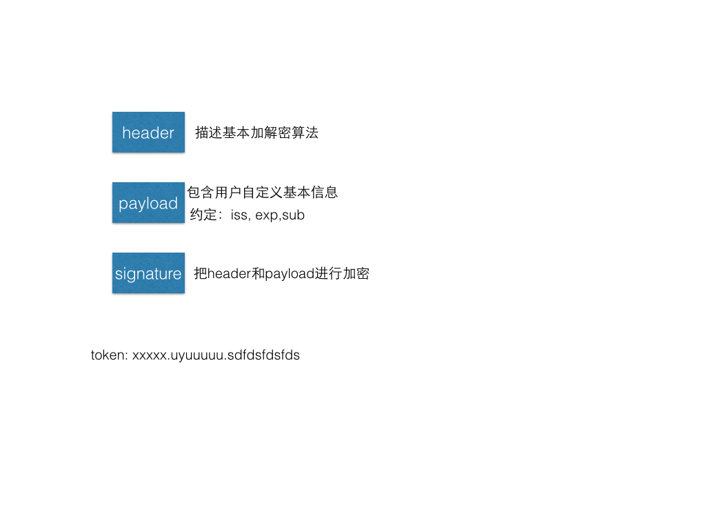

# JWT校验

## 参考教程

+ [彻底理解cookie、session、token](https://github.com/19920625lsg/VueStudy/blob/master/VueJD/%E7%AC%AC3%E7%AB%A0_%E6%B3%A8%E5%86%8C%E7%99%BB%E5%BD%95%E5%AE%9E%E6%88%98/%E5%BD%BB%E5%BA%95%E7%90%86%E8%A7%A3cookie_session%E5%92%8Ctoken.md)
+ [小D课堂在线教育系统之JWT校验](https://edu.51cto.com/center/course/lesson/index?id=280435)

## 开发在线教育视频站点核心业务之JWT微服务下的用户登录权限校验 

### 1、单机和分布式应用的登录检验讲解

> 简介：讲解单机和分布式应用下登录校验，session共享，分布式缓存使用



#### 1.1、单机tomcat应用登录检验



+ sesssion保存在浏览器和应用服务器会话之间
+ 用户登录成功，服务端会保证一个session，当然会给客户端一个sessionId，
+ 客户端会把sessionId保存在cookie中，每次请求都会携带这个sessionId

#### 1.2、分布式应用中session共享

> 真实的应用不可能单节点部署，所以就有个多节点登录session共享的问题需要解决

+ 1）tomcat支持session共享，但是有广播风暴；用户量大的时候，占用资源就严重，不推荐
  
+ 2）使用redis存储token
  > 服务端使用UUID生成随机64位或者128位token，放入redis中，然后返回给客户端并存储在cookie中，用户每次访问都携带此token，服务端去redis中校验是否有此用户即可

  

### 2、微服务下登录检验解决方案 JWT讲解

> 简介：微服务下登录检验解决方案 JWT讲解 `json wen token`



#### 2.1、JWT 是一个开放标准，它定义了一种用于简洁，自包含的用于通信双方之间以 JSON 对象的形式安全传递信息的方法。

> JWT 可以使用 HMAC 算法或者是 RSA 的公钥密钥对进行签名

简单来说，就是通过一定规范来生成token，然后可以通过解密算法逆向解密token，这样就可以获取用户信息

```json
{
    "id":888,
    "name":"小D",
    "expire":10000
}
```

```javascript
funtion 加密(object, appsecret){
    xxxx
    return base64( token);
}
```

```javascript
function 解密(token ,appsecret){
    xxxx
    //成功返回true,失败返回false
}
```

+ 优点：
  + 1）生产的token可以包含基本信息，比如id、用户昵称、头像等信息，避免再次查库
  + 2）存储在客户端，不占用服务端的内存资源
+ 缺点：
  + token是经过base64编码，所以可以解码，因此token加密前的对象不应该包含敏感信息如用户权限，密码等

#### 2.2、JWT格式组成 头部、负载、签名

> header+payload+signature

+ 头部：主要是描述签名算法
+ 负载：主要描述是加密对象的信息，如用户的id等，也可以加些规范里面的东西，如iss签发者，exp 过期时间，sub 面向的用户
+ 签名：主要是把前面两部分进行加密，防止别人拿到token进行base解密后篡改token


#### 2.3、关于jwt客户端存储

> 可以存储在cookie，localstorage和sessionStorage里面

### 3、登录检验JWT实战之封装通用方法

> 讲解：引入相关依赖并开发JWT工具类

### 3.11、加入相关依赖

```xml
<!-- JWT相关 -->
<dependency>
    <groupId>io.jsonwebtoken</groupId>
    <artifactId>jjwt</artifactId>
    <version>0.7.0</version>
</dependency>
```

### 3.2、开发生产token方法

### 3.3、开发检验token方法

## 4、Springboot2.x用户登录拦截器开发实战

> 简介：实战开发用户登录拦截器拦截器 LoginInterceptor

### 4.1、实现接口 LoginInterceptor implements HandlerInterceptor

### 4.2、重写preHandler

```java
String accessToken = request.getHeader("token");
if(accessToken == null){
    accessToken = request.getParameter("token");
}
if (accessToken != null ) {
    Claims claims = JWTUtils.checkJWT(accessToken);
    Integer id = (Integer)claims.get("id");
    String  name = (String)claims.get("name");
    request.setAttribute("user_id",id);
    request.setAttribute("name",name);
    //普通用户
    return true;
}
return false;
```

### 4.3、配置拦截器

```java
@Configuration
InterceptorConfig implements WebMvcConfigurer

@Override
public void addInterceptors(InterceptorRegistry registry) {

    registry.addInterceptor(new LoginInterceptor()).addPathPatterns("/user/api/v1/*/**");

    WebMvcConfigurer.super.addInterceptors(registry);
}
```

### 4.4、响应前端数据

```java
public static void sendJsonMessage(HttpServletResponse response, Object obj) throws Exception {
    Gson g = new Gson();
    response.setContentType("application/json; charset=utf-8");
    PrintWriter writer = response.getWriter();
    writer.print(g.toJson(obj));
    writer.close();
    response.flushBuffer();
}
```